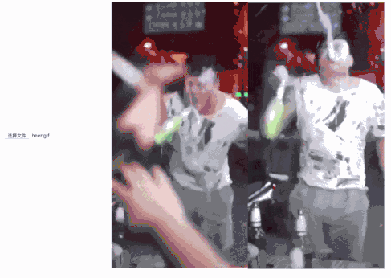

# Reverse Gif

## Important

**Gif must less than 5M size.**

## Preview



## Use

**Best way:** open [Reverse_Gif](https://kvker.github.io/Reverse_Gif/)

* service the index.html

  service the index.html, like `anywhere` and `live-server`:

  `anywhere index.html` or `live-server` else use yourself service.

* uplaod gif

  click input to upload a gif, then wait...

* show result

  wait...

## Core code

html
```html
<input id="input" type="file">
<canvas id="canvas"></canvas>


<script src="lib/gif.js"></script>
<script src="lib/libgif.js"></script>
```

input -> upload file
canvas -> draw initial img(gif)
img -> show the last img

and

need gif.js and libgif.js, thx for them.

js
```js
import RG from '../lib/reverse_gif.js'
RG.init('canvas', 'input', 'result')
```

only a init function, so easy.

## THX
